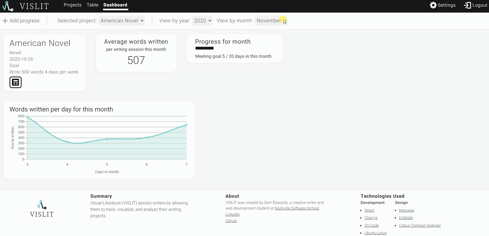

# Dashboard View

## Sorting
The dashboard view has the same sorting as the Table View.  
From the navigation bar you can:
- Add progress (with the same modal as the Project View)
- Select a project to view on the table
- Select year
- Select month

## Cards on dashboard
- Project summary card with:
    - Project title
    - Project type
    - Start date
    - Goal
    - Link to table
- Average words written per writing session for month
- Progress bar for how many days user is meeting goals
- Line graph with words written per day for selected month

